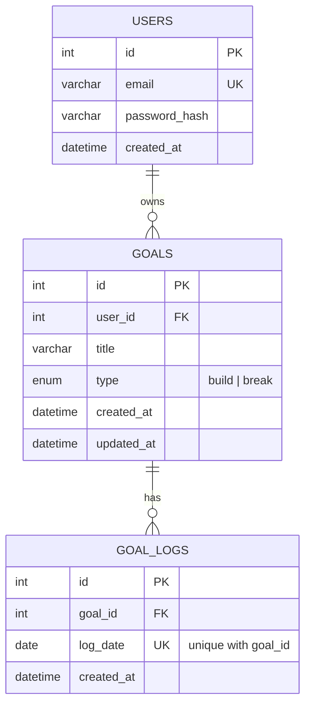

# Entity-Relationship Diagram

## Cardinality

- **users → goals**: one-to-many. One user can own many goals; a goal belongs to exactly one user. `goals.user_id` has `ON DELETE CASCADE`, so deleting a user removes all their goals.
- **goals → goal_logs**: one-to-many. One goal can have many logs (one row per day it was acted on); a log belongs to exactly one goal. `goal_logs.goal_id` has `ON DELETE CASCADE`, so deleting a goal removes all its logs.

## Keys

| Table | Primary Key | Foreign Key | Unique Constraint |
|---|---|---|---|
| `users` | `id` | — | `email` |
| `goals` | `id` | `user_id` → `users.id` | — |
| `goal_logs` | `id` | `goal_id` → `goals.id` | (`goal_id`, `log_date`) — prevents double-logging the same day |

## Notes on data meaning

- `goals.type` distinguishes the two habit modes: `build` (habit to reinforce) or `break` (habit to quit).
- `goal_logs` is intentionally generic — one row = "an event happened on this goal, on this date." The **meaning** of that row depends on the parent goal's `type`:
  - `type = build` → a row means "completed that day"
  - `type = break` → a row means "relapsed that day"
- Streaks and weekly completion rate are **derived at query time** from `goal_logs`, not stored as columns — this avoids the two ever going out of sync. See `docs/API.md` for the exact calculation.

Source: `backend/src/db/migrations/001_init.sql`
